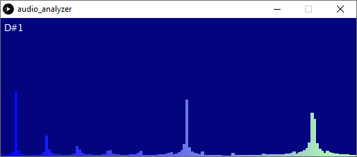

# Audio Analyzer Tool
In order to make our project more interactive and include more programming, we are writing this Processing sketch that will act as a tuner.

## Features:
* Can detect audio input through the computer mic
* Renders the audio waveform as a row of bars

## Todo:
* Fix detection of notes so that it is more accurate
* Add tuner functionality, telling the user how in tune the note they are playing is
